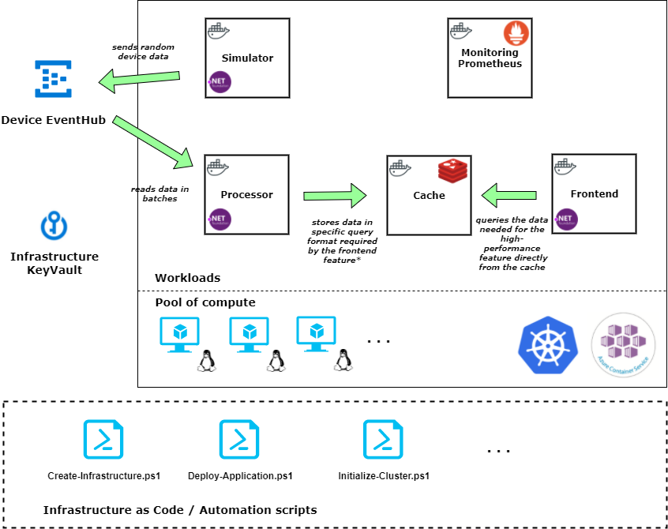

Current state: stable but undocumented

# Device Cache - Containers

Simple .NET Core 2.0 microservice application based on Microsoft Azure, Kubernetes (Azure Container Service), Helm & Powershell.

Follows the [12 Factor App](https://12factor.net/) approach and is built using cloud-native principle of [CaaS](http://blog.kubernetes.io/2017/02/caas-the-foundation-for-next-gen-paas.html) for stateless services (Kubernetes) and **PaaS** for stateful workloads (in this case Azure EventHub).

Implemented scenario showcases handling events from Event Hubs and storing the last information recieved (common IoT cloud use case) into a cache (Redis) available for querying (high performance / throughput scenario / feature) - kind of a CQRS thing for IoT :)

## Setup instructions and general how-to

[Setup & first run](docs/setup.md)

## Roadmap

[Finished and planned features](docs/roadmap.md)

## Architecture

