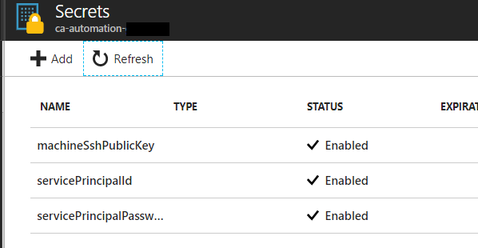

# Prerequisites for cloud cluster deployment

In case you will be also deploying a remote cluster with ACS (Create-Infrastructure.ps1 script without the -SkipClusterInCloud flag), you will need to setup some prerequisites for such deployment:

- Subscription admin service principal credentials (**you need to provide this**)
- Public SSH key (**you need to provide this**)

All the prerequistes will be automatically saved in a key vault which can be accessed later in other scripts.

## Getting a service principal credentials

To create and get the service principal credentials, simply follow these [instructions](https://docs.microsoft.com/en-us/azure/azure-resource-manager/resource-group-create-service-principal-portal)(scroll down to "Create an Azure Active Directory application" section). You will need the application ID and the key from your principal.

## Getting a public SSH key

For SSH access, you will need a private / public key pair. For setting these up under windows, you can find [some instructions here](https://docs.microsoft.com/en-us/azure/virtual-machines/linux/ssh-from-windows).

You could also use some of the tools like **Bitvise** which are capable of creating private / public keys themselves. 

**Tip**: if you used Azure CLI to provision ACS clusters already, you can simply reuse the public key found in `C:\Users\<<your user>>\.ssh`

## Running the Create-CloudClusterPrerequisites.ps1 script

First, make sure you log in to your Azure Subscription with

```powershell
Login-AzureRmAccount
```

and, if necessary, switch to the correct subscription using

```powershell
# to find out the subscirption id, run Get-AzureRmSubscription
Select-AzureRmSubscription
```

Execute this line to securely enter your credentials for the service principal:

```powershell
$servicePrincipalCredentials = Get-Credential
```

Afterwards, you can execute the Create-Prerequisites.ps1 script itself: 

``` powershell
.\Create-CloudClusterPrerequisites.ps1 -EnvironmentTag <<your_env_tag>> -MachineSshPublicKey "ssh-rsa AAAA...6SkIQ0opBt" -ServicePrincipalCredentials $servicePrincipalCredentials
```

If everything was setup correctly, you can verify the contents of your key vault in the cloud:



Key vault name will be `ca-automation-<<your_env_tag>>`